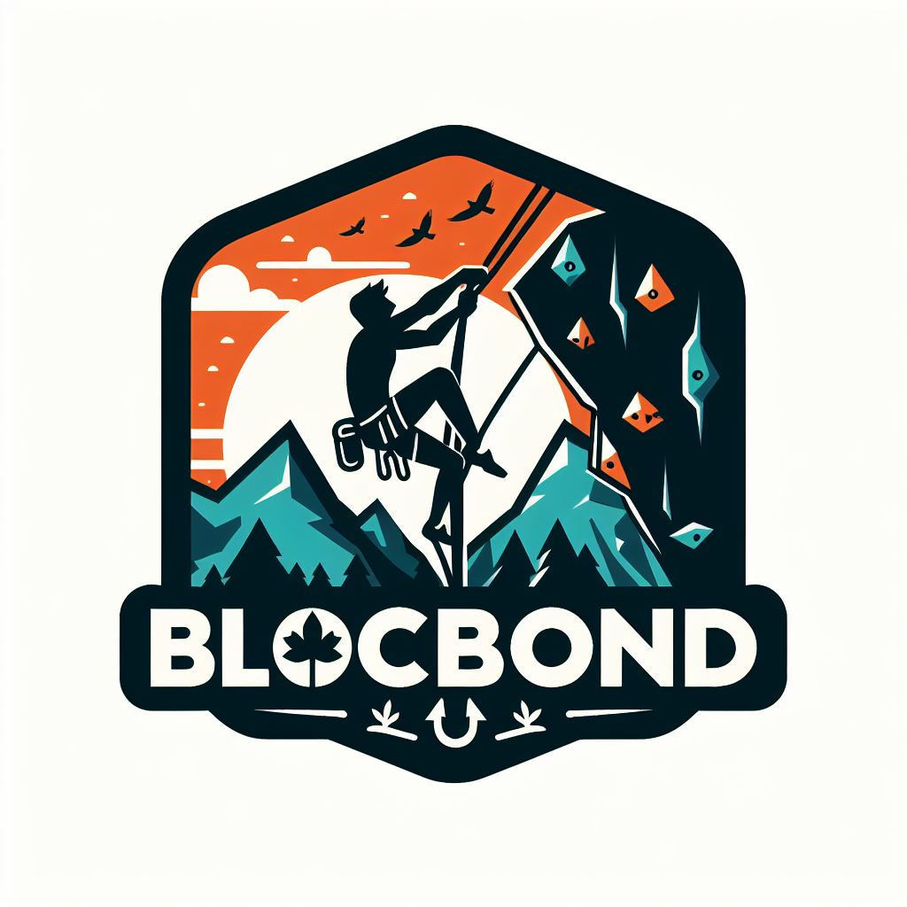

# Backend for BlocBond

Flask-based server that supports handling request from the Next.js front-end application.

<!-- Banner Image -->
<div align="center">
  
</div>

## Prerequisites

Python 3.12 or higher

## Local development

```bash
pip install -r requirements.txt
python main.py
```

To test using Docker:

```bash
# note: entrypoint for docker is tucon_backend/__init__.py:app
docker run --rm --env-file .env -p 8080:8080 -it $(docker build -q .)
```

## Manual deploy to Google Cloud Run

1. Install Google Cloud CLI - https://cloud.google.com/sdk/docs/install-sdk
2. Run the following commands. Note that 'gdschackathon2024-422307' is the projectID.

```bash
gcloud init

gcloud run deploy src --region=us-east1 --source=.
```

## Useful links

GCP Platform: https://cloud.google.com/

Flask WebServer: https://flask.palletsprojects.com/en/3.0.x/

## Resizing Images in folder (in folder with pics)
for file in *.jpg; do sips -z 1000 750 "$file"; done

## List files as a comma seperated list (same level as folder)
find FOLDER_NAME -type f -exec printf '{}, ' \; | sed 's/, $//'

## ChatGPT prompt for filling in metadata of routes
Please generate a list of 12 json objects using the following format for each object in the list:
{
  "id": 1,
  "climb_name": "",
  "gym_name": "Gneiss Climbing - Hill Security",
  "gym_id": "",
   "v_rating": "",
   "climb_type": "",
   "hold_type": "",
   "description": "",
}

For the "id" key, have the values starting at 1 and counting up one at a time 
For the "climb_name" key, come up with a unique one or two word name for a rock climbing route
For the "gym_name" key, ensure that each value is "Gneiss Climbing - Hill Security"
For the "gym_id" key, ensure that each value is "5"
For the "v_rating" key, please make sure that it is a value that follows the format of the letter V followed by a number from 1 to 15, eg: "V4"
For"climb_type" key, select a value from one of the following options: "slab", "overhang", "dynamic"
For the "hold_type" key, select a value from one of the following options: "crimps", "pinches", "slopers", "jugs", "pockets", "volumes"
For the "description" key, please write a short 5-10 word description that should describe the climb
